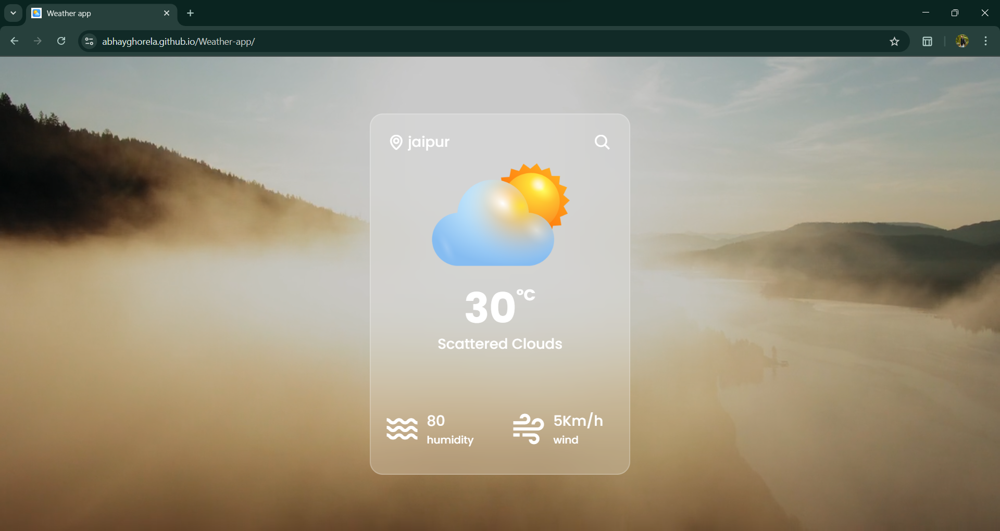
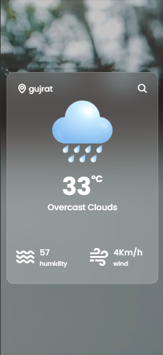

# 🌦️ Weather App

A simple and elegant weather application built with **HTML**, **CSS**, and **JavaScript** that fetches real-time weather data using an API. The app allows users to search for any city and view current weather conditions.

## 🔗 Live Demo

[Click here to try it out](https://abhayghorela.github.io/Weather-app/)

## 🚀 Features

- 🔍 Search weather by city name
- 🌡️ View temperature, weather condition, humidity, and wind speed
- ⛅ Dynamic weather icons and background
- 📱 Responsive design for desktop and mobile
- 🎨 Clean and modern UI using custom PNG icons

## 🛠️ Technologies Used

| Tech         | Description                       |
|--------------|------------------------------------|
| HTML         | Markup structure                   |
| CSS          | Styling and layout                 |
| JavaScript   | Logic and API integration          |
| Weather API  | Real-time weather data (e.g. OpenWeatherMap)

## 🌐 How It Works

1. User enters a city name.
2. The app sends a request to the weather API.
3. Weather data is retrieved and displayed on the page.
4. Icons and styles update dynamically based on weather conditions.

## 🧾 File Structure

````

Weather-app/
├── icons/              # PNG icons for various weather types
├── index.html          # Main HTML file
├── style.css           # Styling for the app
├── script.js           # JavaScript logic and API calls
└── README.md

````

## 📸 Screenshots

#### Desktop view


#### Mobile view


## 🧪 How to Use Locally

1. **Clone this repository:**
   ```bash
   git clone https://github.com/AbhayGhorela/Weather-app.git


2. **Open the `index.html` file in your browser:**

   * No need for any installations.
   * Just double-click `index.html` or open it via a code editor + live server.

## 📌 Notes

* Make sure to include your own API key directly in `script.js` if using OpenWeatherMap or similar.
* Never use the API key included in this repo.
## ❌ Licensing & Restrictions

This is **NOT an open-source project**. You are **not allowed** to:

- Copy or reuse any part of the source code  
- Use or extract the API key used in this project  
- Redistribute this project without permission

> 🔒 **All rights reserved © Abhay Ghorela.**

---

**Created by [Abhay Ghorela](https://github.com/AbhayGhorela)**
⭐ Star this repo if you found it useful!

